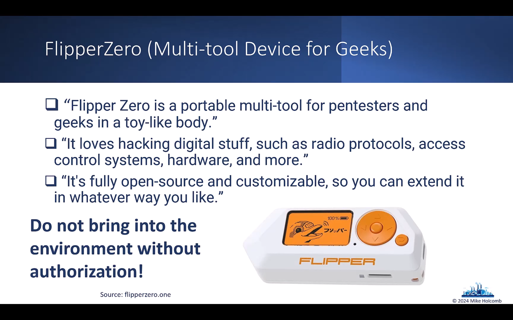
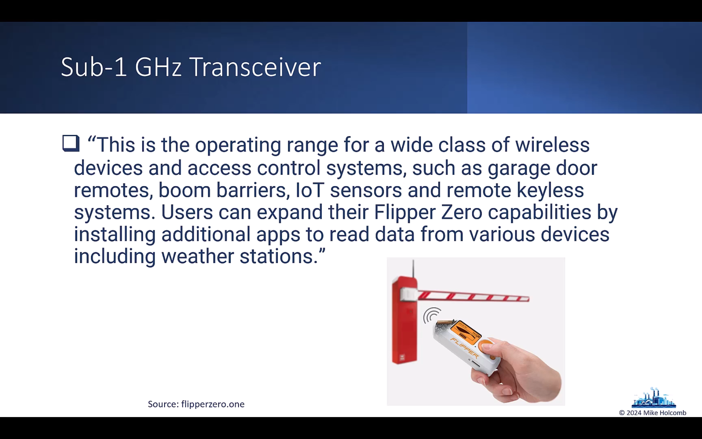
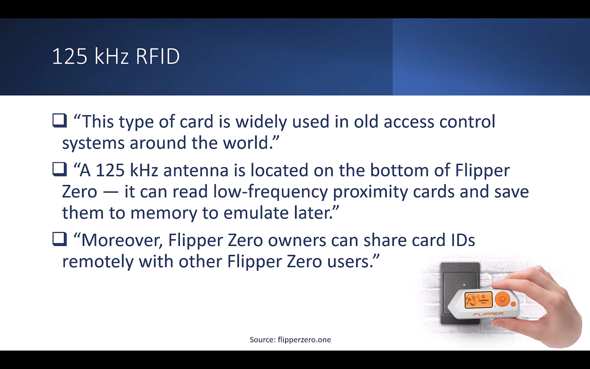
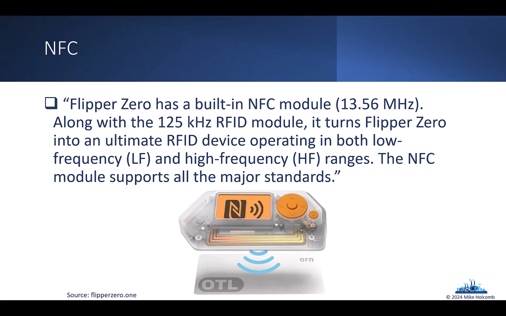
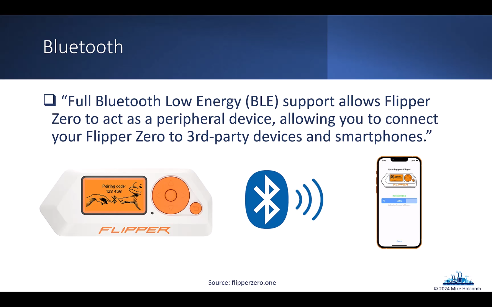

# ICS/OT Penetration Testing

> Vidath Dissanayake | Sri Lanka  
> Links: [Getting Started in ICS_OT Cybersecurity](Getting%20Started%20in%20ICS_OT%20Cybersecurity.md)
> Sources: [Getting Started in ICS/OT Cyber Security part 10](https://www.youtube.com/watch?v=A-gTRMQpy5w&list=PLOSJSv0hbPZAlINIh1HcB0L8AZcSPc80g&index=11) [ICSRank](https://icsrank.com) [Shodan](https://shodan.io)

---


## Reconnaissance


[ICSRank](https://icsrank.com) provides a GUI where you can select a device you want to search for, and it will create a [Shodan](https://shodan.io) query and search it.

[SNMP](../../network/communication%20protocol/TCP%20IP%20layer%204/OSI%20layer%207/SNMP.md) is often useful, as most ICS systems will just disclose information when queried with SNMP. [snmpwalk](../../tools/hacking/network/protocol%20specific/SNMP/snmpwalk.md) can be used for this. 

---

## Initial Access


### Initial Access Techniques

#### Rogue Master


#### Wi-Fi Network Access


#### Other Wireless Attacks






---

## Discovery


### Network Connection Enumeration

On Windows, to list network connections,
```
netstat -nao
```
Can use to find other local devices.

Look at network connection tables available in some PLCs.

Perform a [Nmap](../../tools/hacking/network/scanning/Nmap.md) scan. Use scripts to gain more information.

---

## Collection


Most PLCs have an app or software that allows discovery of PLCs. These usually provide a lot of information.

---

## Execution


---

## Lateral Movement


---

## Persistence


---

## Evasion


---

## Inhibit Response Functions

This means,
- loss of control
- loss of visibility
- loss of both


---

## Command and Control

