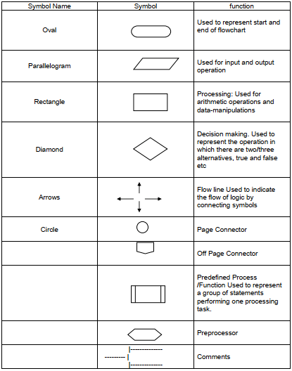

# Algorithms

> Vidath Dissanayake | Sri Lanka  
> Links: [programming](../programming.md)
> Sources: 

---

An algorithm is a step-by-step procedure for solving a problem. 

An algorithm is created at design time and then a program is written using it during implementation time. Someone with domain knowledge must write the algorithm so that a programmer who doesn't have deep domain knowledge can implement it.

After writing a program, we should analyse it to see whether it is accurate. If a program is written according to an algorithm, it is already accurate. So we test it to see if it works and to see whether there are bugs.

We can use flow charts to represent algorithms.

