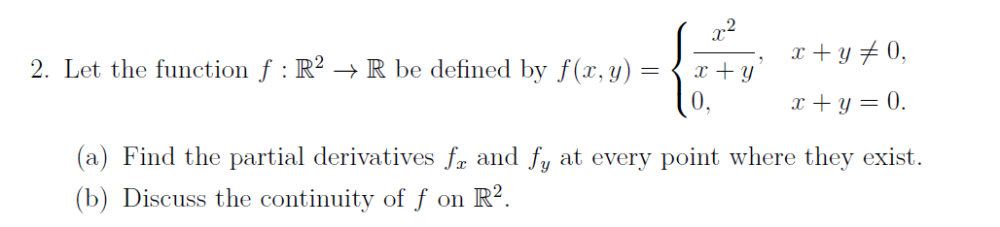
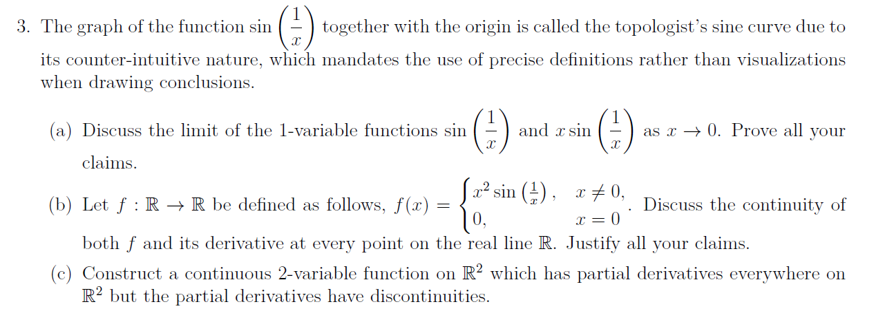
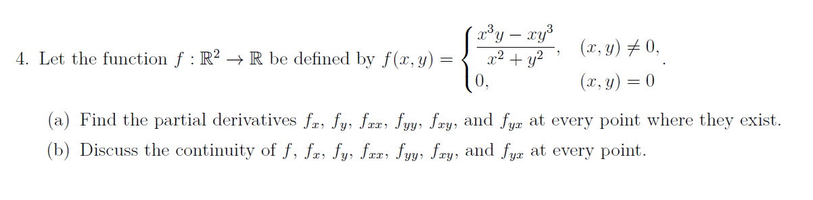

This is a classic multivariable calculus problem that tests your understanding of how functions behave near "trouble spots"—in this case, the line $x + y = 0$.

Here is the step-by-step breakdown of the partial derivatives and the continuity of the function $f(x, y)$.

---

## (a) Find the partial derivatives $f_x$ and $f_y$

### 1. Where $x + y \neq 0$

In the open region where the denominator isn't zero, we can use standard differentiation rules (the quotient rule).

* **For $f_x$:**

$$f_x = \frac{\partial}{\partial x} \left( \frac{x^2}{x+y} \right) = \frac{(2x)(x+y) - (x^2)(1)}{(x+y)^2} = \frac{x^2 + 2xy}{(x+y)^2}$$

* **For $f_y$:**

$$f_y = \frac{\partial}{\partial y} \left( \frac{x^2}{x+y} \right) = \frac{(0)(x+y) - (x^2)(1)}{(x+y)^2} = \frac{-x^2}{(x+y)^2}$$

### 2. Where $x + y = 0$ (Points on the line $y = -x$)

We must use the limit definition of a partial derivative at a point $(a, -a)$.

* **For $f_x(a, -a)$:**

$$f_x(a, -a) = \lim_{h \to 0} \frac{f(a+h, -a) - f(a, -a)}{h} = \lim_{h \to 0} \frac{\frac{(a+h)^2}{(a+h)-a} - 0}{h} = \lim_{h \to 0} \frac{(a+h)^2}{h^2}$$

If $a \neq 0$, the numerator approaches $a^2$ while the denominator goes to $0$. The limit is $\infty$.
If $a = 0$ (the origin), the limit is $\lim_{h \to 0} \frac{h^2}{h^2} = 1$.
**Result:** $f_x$ exists on this line **only at $(0,0)$**, where $f_x(0,0) = 1$.
* **For $f_y(a, -a)$:**

$$f_y(a, -a) = \lim_{h \to 0} \frac{f(a, -a+h) - f(a, -a)}{h} = \lim_{h \to 0} \frac{\frac{a^2}{a-a+h} - 0}{h} = \lim_{h \to 0} \frac{a^2}{h^2}$$

If $a \neq 0$, the limit is $\infty$.
If $a = 0$, the function $f(0, h) = \frac{0^2}{0+h} = 0$, so the limit is $0$.
**Result:** $f_y$ exists on this line **only at $(0,0)$**, where $f_y(0,0) = 0$.

---

## (b) Discuss the continuity of $f$ on $\mathbb{R}^2$

To be continuous at a point $(x_0, y_0)$, the limit $\lim_{(x,y) \to (x_0, y_0)} f(x,y)$ must equal $f(x_0, y_0)$.

### 1. Outside the line $x+y=0$

The function is a rational function with a non-zero denominator. Therefore, it is **continuous** at all points where $x+y \neq 0$.

### 2. On the line $x+y=0$

Let's test the limit as we approach a point $(a, -a)$ on the line.

* **At the origin $(0,0)$:**
Let's approach along the path $y = kx - x$ (which is $y = (k-1)x$):

$$\lim_{x \to 0} f(x, (k-1)x) = \lim_{x \to 0} \frac{x^2}{x + (k-1)x} = \lim_{x \to 0} \frac{x^2}{kx} = \lim_{x \to 0} \frac{x}{k} = 0$$

Since the limit is $0$ regardless of the path (as long as we don't approach along the line of discontinuity itself), $f$ is **continuous at $(0,0)$**.
* **At points $(a, -a)$ where $a \neq 0$:**
Consider the point $(1, -1)$. Let's approach it along the path $y = -1$.

$$\lim_{x \to 1} f(x, -1) = \lim_{x \to 1} \frac{x^2}{x-1}$$

As $x \to 1$, the numerator $\to 1$ and the denominator $\to 0$. The limit is $\pm \infty$.
Since the limit does not exist (and certainly does not equal $f(a,-a)=0$), the function is **discontinuous** at every point on the line $x+y=0$ except for the origin.

### Summary of Continuity:

* $f$ is continuous on $\mathbb{R}^2 \setminus \{(x, y) : x + y = 0, x \neq 0\}$.
* In plain English: It is continuous everywhere **except** on the line $y = -x$, excluding the origin.

---
\

This set of problems explores the "Topologist's Sine Curve" family, which provides some of the best counter-examples in analysis. These functions show that having a derivative doesn't necessarily mean that derivative is nice or continuous.

---

## (a) Limits as $x \to 0$

### 1. The limit of $\sin(1/x)$

**Claim:** The limit $\lim_{x \to 0} \sin\left(\frac{1}{x}\right)$ does not exist.

**Proof:** We use the sequential criterion for limits. Consider two sequences $a_n$ and $b_n$ both approaching $0$:

* Let $a_n = \frac{1}{2n\pi + \pi/2}$. As $n \to \infty, a_n \to 0$. Then $\sin(1/a_n) = \sin(2n\pi + \pi/2) = 1$.
* Let $b_n = \frac{1}{2n\pi - \pi/2}$. As $n \to \infty, b_n \to 0$. Then $\sin(1/b_n) = \sin(2n\pi - \pi/2) = -1$.
Since the function approaches different values along different sequences, the limit does not exist. The function oscillates infinitely often between $-1$ and $1$ as it nears the origin.

### 2. The limit of $x \sin(1/x)$

**Claim:** $\lim_{x \to 0} x \sin\left(\frac{1}{x}\right) = 0$.

**Proof:** We use the **Squeeze Theorem**. We know that for all $x \neq 0$:

$$-1 \le \sin\left(\frac{1}{x}\right) \le 1$$

Multiplying by $|x|$:

$$-|x| \le x \sin\left(\frac{1}{x}\right) \le |x|$$

Since $\lim_{x \to 0} (-|x|) = 0$ and $\lim_{x \to 0} |x| = 0$, by the Squeeze Theorem, the limit of the middle term must also be $0$.

---

## (b) Continuity of $f(x)$ and $f'(x)$

Given $f(x) = x^2 \sin(1/x)$ for $x \neq 0$ and $f(0) = 0$:

### 1. Continuity of $f(x)$

For $x \neq 0$, $f$ is the product of continuous functions, so it is continuous. At $x = 0$, we check:

$$\lim_{x \to 0} x^2 \sin\left(\frac{1}{x}\right) = 0 = f(0)$$

(Proven via Squeeze Theorem: $-x^2 \le x^2 \sin(1/x) \le x^2$). Thus, **$f$ is continuous on all of $\mathbb{R}$.**

### 2. Continuity of $f'(x)$

First, find the derivative. For $x \neq 0$, use the product and chain rules:

$$f'(x) = 2x \sin\left(\frac{1}{x}\right) + x^2 \cos\left(\frac{1}{x}\right) \left(-\frac{1}{x^2}\right) = 2x \sin\left(\frac{1}{x}\right) - \cos\left(\frac{1}{x}\right)$$

At $x = 0$, use the limit definition:

$$f'(0) = \lim_{h \to 0} \frac{h^2 \sin(1/h) - 0}{h} = \lim_{h \to 0} h \sin\left(\frac{1}{h}\right) = 0$$

So, $f'(x)$ exists everywhere. However, let's check the limit of $f'(x)$ as $x \to 0$:

$$\lim_{x \to 0} \left( 2x \sin\left(\frac{1}{x}\right) - \cos\left(\frac{1}{x}\right) \right)$$

The first term goes to $0$, but the second term $\cos(1/x)$ oscillates between $-1$ and $1$ and has no limit. Therefore, **$f'(x)$ is discontinuous at $x = 0$.**

---

## (c) A 2-variable function with discontinuous partials

To construct this, we extend the logic from part (b) into two dimensions. We want a function that is "well-behaved" enough to have derivatives, but "wild" enough that those derivatives don't stay steady at the origin.

Define $g: \mathbb{R}^2 \to \mathbb{R}$ as:

$$g(x, y) = \begin{cases} (x^2 + y^2) \sin\left(\frac{1}{\sqrt{x^2+y^2}}\right) & (x, y) \neq (0, 0) \\ 0 & (x, y) = (0, 0) \end{cases}$$

**Why this works:**

1. **Continuity:** By the Squeeze Theorem, $\lim_{(x,y) \to (0,0)} g(x,y) = 0$, so it is continuous everywhere.
2. **Partial Derivatives:** At $(0,0)$, $g_x(0,0) = \lim_{h \to 0} \frac{h^2 \sin(1/|h|)}{h} = 0$. The same applies to $g_y$.
3. **Discontinuity of Partials:** If you calculate $g_x$ for $(x,y) \neq (0,0)$, you will get a term involving $\cos\left(\frac{1}{\sqrt{x^2+y^2}}\right)$, which oscillates and prevents the partial derivative from having a limit at the origin.

---
\

## 4. Mixed Partial Derivatives Analysis

This function is a classic example used to show that $f_{xy}$ does not always equal $f_{yx}$ if the second partials are not continuous.

### (a) Finding the Derivatives

* **At $(x, y) \neq (0, 0)$:** Use the quotient rule:
* $f_x = \frac{(3x^2y - y^3)(x^2 + y^2) - (x^3y - xy^3)(2x)}{(x^2 + y^2)^2} = \frac{x^4y + 4x^2y^3 - y^5}{(x^2 + y^2)^2}$
* $f_y = \frac{(x^3 - 3xy^2)(x^2 + y^2) - (x^3y - xy^3)(2y)}{(x^2 + y^2)^2} = \frac{x^5 - 4x^3y^2 - xy^4}{(x^2 + y^2)^2}$

* **At $(0, 0)$:** Use the limit definition:
* $f_x(0,0) = \lim_{h \to 0} \frac{f(h, 0) - f(0,0)}{h} = \lim_{h \to 0} \frac{0 - 0}{h} = 0$. Similarly, $f_y(0,0) = 0$.

* **Mixed Partials at $(0,0)$:**
* $f_{xy}(0,0) = \frac{\partial}{\partial y} f_x(0,0) = \lim_{h \to 0} \frac{f_x(0, h) - f_x(0, 0)}{h} = \lim_{h \to 0} \frac{-h^5/h^4 - 0}{h} = -1$.
* $f_{yx}(0,0) = \frac{\partial}{\partial x} f_y(0,0) = \lim_{h \to 0} \frac{f_y(h, 0) - f_y(0, 0)}{h} = \lim_{h \to 0} \frac{h^5/h^4 - 0}{h} = 1$.

### (b) Continuity Discussion

* **$f$ is continuous everywhere**, including the origin (can be shown using polar coordinates where $f(r, \theta) = r^2 \cos \theta \sin \theta \cos(2\theta)$).
* **$f_x$ and $f_y$ are continuous everywhere.**
* **$f_{xx}, f_{yy}, f_{xy},$ and $f_{yx}$ are continuous everywhere except at $(0, 0)$.** Because $f_{xy}(0,0) \neq f_{yx}(0,0)$, Clairaut's Theorem implies that the second-order partial derivatives cannot be continuous at the origin.

Would you like me to show the polar coordinate proof for the continuity of $f$ at the origin?

---

The following are the solutions and explanations for the **Multivariate Calculus and PDE** section of your Tutorial 05.

---

## 1. Analysis of $f(x,y) = \frac{x^2y^2}{x^2+y^2}$

This problem explores the relationship between symmetry, partial derivatives, and Clairaut's Theorem.

### (a) Symmetry by Inspection

$f(x,y) = \frac{x^2y^2}{x^2+y^2}$. If we swap $x$ and $y$:
$f(y,x) = \frac{y^2x^2}{y^2+x^2}$.
Since multiplication and addition are commutative, $y^2x^2 = x^2y^2$ and $y^2+x^2 = x^2+y^2$. Thus, **$f(x,y) = f(y,x)$**.

### (b) Symmetry and Mixed Partials

If $f(x,y) = f(y,x)$, then the operation of taking the derivative with respect to $x$ and then $y$ is identical to taking it with respect to $y$ and then $x$ for all points where the function is smooth. Therefore, **$f_{xy}(x,y) = f_{yx}(x,y)$** for all $(x,y) \neq (0,0)$.

### (c) Partial Derivatives at the Origin

Using the limit definition:

* 
$f_x(0,0) = \lim_{h \to 0} \frac{f(h,0) - f(0,0)}{h} = \lim_{h \to 0} \frac{0 - 0}{h} = \mathbf{0}$.

* 
$f_y(0,0) = \lim_{h \to 0} \frac{f(0,h) - f(0,0)}{h} = \lim_{h \to 0} \frac{0 - 0}{h} = \mathbf{0}$.

### (d) Mixed Partials at the Origin

Using the provided definition:

* $f_{xy}(0,0) = \lim_{h \to 0} \frac{f_x(0,h) - f_x(0,0)}{h}$. Since $f_x(0,h) = 0$ for all $h$, the limit is **0**.

* Similarly, $f_{yx}(0,0) = \lim_{h \to 0} \frac{f_y(h,0) - f_y(0,0)}{h} = \mathbf{0}$.

### (e) & (f) Continuity of $f_{xy}$

An explicit formula for $f_{xy}(x,y)$ (for $(x,y) \neq (0,0)$) involves multiple applications of the quotient rule. When testing paths for $\lim_{(x,y) \to (0,0)} f_{xy}(x,y)$:

* 
**Along $y=0$:** $f_{xy}(x,0) = 0$, so the limit is 0.

* 
**Along $y=x$:** The expression simplifies to a non-zero constant.
Because different paths yield different limits, **$f_{xy}$ is not continuous at the origin**.

### (g) Clairaut’s Theorem

This does **not** contradict Clairaut's Theorem.

> 
> **Clairaut's Theorem Hypotheses:** $f_{xy}$ and $f_{yx}$ must be **continuous** on a disk $D$ containing the point $(a,b)$ for $f_{xy}(a,b) = f_{yx}(a,b)$ to be guaranteed.
> Since $f_{xy}$ is not continuous at $(0,0)$, the theorem's hypotheses are not met at that specific point.
> 
> 

---

## 2. Tangent Planes and Differentiability of $f(x,y) = \sqrt{|xy|}$

### (a) Existence of $f_x, f_y$ at $(0,0)$

* 
$f_x(0,0) = \lim_{h \to 0} \frac{\sqrt{|h \cdot 0|} - 0}{h} = 0$.

* 
$f_y(0,0) = \lim_{h \to 0} \frac{\sqrt{|0 \cdot h|} - 0}{h} = 0$.
Both partial derivatives exist and are zero.

### (b) & (c) Non-differentiability at Origin

For $f$ to be differentiable at $(0,0)$, the limit $\lim_{(h,k) \to (0,0)} \frac{f(h,k) - f(0,0) - f_x(0,0)h - f_y(0,0)k}{\sqrt{h^2+k^2}}$ must be 0.
Testing the path $h=k$: $\lim_{h \to 0} \frac{\sqrt{|h^2|}}{\sqrt{2h^2}} = \frac{1}{\sqrt{2}} \neq 0$.
Thus, $f$ is **not differentiable** at $(0,0)$, and consequently, **no tangent plane exists** there.

### (d) & (e) Tangent Plane at $(1, -1)$

At $(1, -1)$, $xy = -1$, so $|xy| = -xy$. Thus $f(x,y) = \sqrt{-xy}$ near this point.

1. 
$f(1, -1) = 1$.

2. 
$f_x = \frac{-y}{2\sqrt{-xy}} \implies f_x(1, -1) = \frac{1}{2}$.

3. 
$f_y = \frac{-x}{2\sqrt{-xy}} \implies f_y(1, -1) = -\frac{1}{2}$.
**Equation:** $z - 1 = \frac{1}{2}(x - 1) - \frac{1}{2}(y + 1) \implies \mathbf{x - y - 2z = 0}$.

---

## 3. Differentials and Approximations

### (a) & (b) Estimating $f(x,y) = \sqrt{101 - x^2 - y^2}$

Using the linearization at $(8,6)$:

$f(8,6) = \sqrt{101 - 64 - 36} = \sqrt{1} = 1$.
$f_x = \frac{-x}{\sqrt{101-x^2-y^2}} \implies f_x(8,6) = -8$.
$f_y = \frac{-y}{\sqrt{101-x^2-y^2}} \implies f_y(8,6) = -6$.
**Approximation:** $f(8.01, 6.01) \approx 1 + (-8)(0.01) + (-6)(0.01) = 1 - 0.08 - 0.06 = \mathbf{0.86}$.

### (c) Differential for $z = 9x^2 + y^2$

$dz = 18x \, dx + 2y \, dy$.
To approximate $9(1.999)^2 + (8.001)^2$:
Let $x=2, y=8, dx=-0.001, dy=0.001$.
$z(2,8) = 9(4) + 64 = 100$.
$dz = 18(2)(-0.001) + 2(8)(0.001) = -0.036 + 0.016 = -0.020$.
**Value** $\approx 100 - 0.02 = \mathbf{99.98}$.

---

## 4. Chain Rule and Partial Derivatives

### (a) Chain Rule for $w = \ln(x^2 + y^2)$

$x^2 + y^2 = u^2 \cos^2 v + u^2 \sin^2 v = u^2$.
So $w = \ln(u^2) = 2\ln(u)$.

* 
$\frac{\partial w}{\partial u} = \mathbf{\frac{2}{u}}$.

* 
$\frac{\partial w}{\partial v} = \mathbf{0}$.

### (b) Second-Order Partials

For $z = xe^{xy}$:

* 
$z_x = e^{xy} + xye^{xy}$.

* 
$z_{xx} = ye^{xy} + y(e^{xy} + xye^{xy}) = \mathbf{(2y + xy^2)e^{xy}}$.

* 
$z_y = x^2e^{xy}$.

* 
$z_{yy} = \mathbf{x^3e^{xy}}$.

* 
$z_{yx} = \frac{\partial}{\partial x}(x^2e^{xy}) = \mathbf{(2x + x^2y)e^{xy}}$.

### (c) Implicit Differentiation

$w = x^2 + yz$ where $x^2 + y^2 + z^2 = 6$.
Differentiating $x^2 + y^2 + z^2 = 6$ with respect to $x$: $2x + 2z\frac{\partial z}{\partial x} = 0 \implies \frac{\partial z}{\partial x} = -\frac{x}{z}$.
$\frac{\partial w}{\partial x} = 2x + y\frac{\partial z}{\partial x} = 2x + y(-\frac{x}{z})$.
At $(1, 2, 1)$: $\frac{\partial w}{\partial x} = 2(1) + 2(-\frac{1}{1}) = 2 - 2 = \mathbf{0}$.

Based on the tutorial provided, here is the step-by-step solution for question **4(d)** in the **Multivariate Calculus and PDE** section:

## Problem Statement

For the surface defined implicitly by $x^2y + y^2z + z^2x = 5$, find expressions for $z_x$ and $z_y$ assuming $z = z(x,y)$.

---

### Solution

To find the partial derivatives of an implicitly defined function $F(x, y, z) = 0$, we use the following formulas:

$$z_x = \frac{\partial z}{\partial x} = -\frac{F_x}{F_z} \quad \text{and} \quad z_y = \frac{\partial z}{\partial y} = -\frac{F_y}{F_z}$$

Let $F(x, y, z) = x^2y + y^2z + z^2x - 5 = 0$.

#### 1. Calculate the partial derivatives of $F$

* **$F_x$** (treat $y$ and $z$ as constants):

$$\frac{\partial}{\partial x}(x^2y + y^2z + z^2x - 5) = 2xy + z^2$$

* **$F_y$** (treat $x$ and $z$ as constants):

$$\frac{\partial}{\partial y}(x^2y + y^2z + z^2x - 5) = x^2 + 2yz$$

* **$F_z$** (treat $x$ and $y$ as constants):

$$\frac{\partial}{\partial z}(x^2y + y^2z + z^2x - 5) = y^2 + 2zx$$

#### 2. Final Expressions

Substitute these into the implicit differentiation formulas:

* **For $z_x$:**

$$z_x = -\frac{2xy + z^2}{y^2 + 2zx}$$

* **For $z_y$:**

$$z_y = -\frac{x^2 + 2yz}{y^2 + 2zx}$$

---

## 5. Tangent Plane to $z = \sqrt{x^2 + y^2}$

### (a) Equation of Tangent Plane

At $(a, b)$, $z_0 = \sqrt{a^2 + b^2}$.
$z_x = \frac{x}{\sqrt{x^2+y^2}} \implies z_x(a,b) = \frac{a}{z_0}$.
$z_y = \frac{y}{\sqrt{x^2+y^2}} \implies z_y(a,b) = \frac{b}{z_0}$.
**Equation:** $z - z_0 = \frac{a}{z_0}(x - a) + \frac{b}{z_0}(y - b)$.
Multiplying by $z_0$: $z \cdot z_0 - z_0^2 = ax - a^2 + by - b^2 \implies \mathbf{ax + by - z \cdot z_0 = 0}$ (since $a^2 + b^2 = z_0^2$).

### (b) Proof of Passing Through Origin

Substitute $(x, y, z) = (0, 0, 0)$ into the plane equation:

$a(0) + b(0) - (0)z_0 = 0$.
Since $0 = 0$ is a true statement, the **tangent plane always passes through the origin**.

